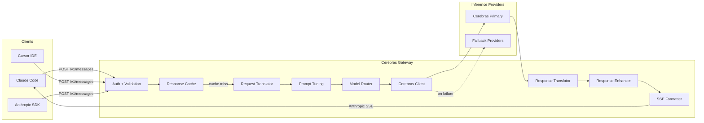

# Cerebras Anthropic-Compatible API Gateway

## Executive Summary

Build a drop-in replacement API gateway that accepts Anthropic Messages API requests and serves them using Cerebras inference. Users change only two environment variables to switch from Anthropic to Cerebras:

```bash
export ANTHROPIC_BASE_URL=https://your-gateway.com
export ANTHROPIC_API_KEY=your-gateway-key
```

---

## Technical Architecture

### API Translation Flow




### Critical Discovery: API Format Mismatch

- **Cerebras API**: OpenAI-compatible chat format (`/v1/chat/completions`)
- **Anthropic API**: Messages format (`/v1/messages`)
- **Solution**: Build translation layer between Anthropic Messages and Cerebras Chat format

**Important Naming Convention:**

- Internally refer to translation as `anthropic_messages` to `cerebras_chat`
- Do NOT call it "OpenAI format" - Cerebras is its own dialect with differences

---

## Phase 1: Core Gateway Implementation

### 1.1 Required Endpoints (per Claude Code docs)


| Endpoint                    | Method | Priority | Purpose              | Notes                   |
| --------------------------- | ------ | -------- | -------------------- | ----------------------- |
| `/v1/messages`              | POST   | P0       | Primary Messages API | Must support streaming  |
| `/v1/messages/count_tokens` | POST   | P1       | Token counting       | Best-effort estimation  |
| `/health`                   | GET    | P0       | Health checks        | Include provider status |


**Required Headers** (must forward to work with Claude Code):

- `anthropic-beta`
- `anthropic-version`
- `x-api-key`

**Rate Limit Headers** (return in all responses):

```python
# Include these headers in every response for client awareness
headers = {
    "X-RateLimit-Limit": "60",        # Requests per minute allowed
    "X-RateLimit-Remaining": "45",    # Requests remaining in window
    "X-RateLimit-Reset": "1640000000" # Unix timestamp when limit resets
}
```

### 1.2 Enhanced Health Check Endpoint

```python
# app/api/routes/health.py

@router.get("/health")
async def health_check():
    """
    Comprehensive health check with provider and dependency status.
    Used by load balancers and monitoring systems.
    """
    cerebras_healthy = await check_cerebras_health()
    redis_healthy = await check_redis_health()
    
    status = "healthy" if (cerebras_healthy and redis_healthy) else "degraded"
    
    return {
        "status": status,
        "version": "1.0.0",
        "providers": {
            "cerebras": {
                "status": "healthy" if cerebras_healthy else "unhealthy",
                "latency_ms": await measure_cerebras_latency()
            }
        },
        "dependencies": {
            "redis": {
                "status": "healthy" if redis_healthy else "unhealthy"
            }
        },
        "timestamp": datetime.utcnow().isoformat()
    }

async def check_cerebras_health() -> bool:
    """Quick ping to Cerebras API"""
    try:
        # Lightweight request to verify connectivity
        async with httpx.AsyncClient(timeout=5.0) as client:
            resp = await client.get(f"{CEREBRAS_BASE_URL}/models")
            return resp.status_code == 200
    except Exception:
        return False

async def check_redis_health() -> bool:
    """Verify Redis connectivity"""
    try:
        await redis_client.ping()
        return True
    except Exception:
        return False
```

### 1.3 Request Translation: Anthropic to Cerebras Chat

**Anthropic Messages Request:**

```python
{
    "model": "claude-sonnet-4-5-20250929",
    "max_tokens": 4096,
    "messages": [
        {"role": "user", "content": "Write a Python HTTP server"}
    ],
    "system": "You are a helpful assistant",
    "temperature": 0.7,
    "stream": true,
    "stop_sequences": ["END"]
}
```

**Translated to Cerebras Chat format:**

```python
{
    "model": "llama-3.3-70b",  # Internal routing
    "max_tokens": 4096,
    "messages": [
        {"role": "system", "content": "[ENHANCED_SYSTEM_PROMPT] + You are a helpful assistant"},
        {"role": "user", "content": "Write a Python HTTP server"}
    ],
    "temperature": 0.595,  # Adjusted: 0.7 * 0.85 for code tasks
    "stream": true,
    "stop": ["END"]
}
```

### 1.4 Response Translation: Cerebras to Anthropic

**Critical Rule: Always echo back the REQUESTED model name**

```python
# Request came with: model="claude-sonnet-4-5-20250929"
# Internal routing used: llama-3.3-70b
# Response MUST return: model="claude-sonnet-4-5-20250929"

requested_model = request.model
internal_model = MODEL_MAP.get(requested_model, DEFAULT_MODEL)
# ... call Cerebras with internal_model ...
response.model = requested_model  # Echo back original
```

**Cerebras Response:**

```python
{
    "id": "chatcmpl-xxx",
    "choices": [{"message": {"role": "assistant", "content": "Here's..."}}],
    "usage": {"prompt_tokens": 50, "completion_tokens": 200}
}
```

**Translated to Anthropic format:**

```python
{
    "id": "msg_xxx",
    "type": "message",
    "role": "assistant",
    "content": [{"type": "text", "text": "Here's..."}],
    "model": "claude-sonnet-4-5-20250929",  # Echo requested model
    "stop_reason": "end_turn",
    "usage": {"input_tokens": 50, "output_tokens": 200}
}
```

### 1.5 Streaming SSE Translation (Critical)

**Cerebras SSE events:**

```
data: {"choices":[{"delta":{"content":"Hello"}}]}
data: {"choices":[{"delta":{"content":" world"}}]}
data: [DONE]
```

**Must translate to Anthropic SSE format:**

```
event: message_start
data: {"type":"message_start","message":{"id":"msg_xxx","type":"message","role":"assistant","model":"claude-sonnet-4","content":[],"stop_reason":null,"usage":{"input_tokens":10,"output_tokens":0}}}

event: content_block_start
data: {"type":"content_block_start","index":0,"content_block":{"type":"text","text":""}}

event: content_block_delta
data: {"type":"content_block_delta","index":0,"delta":{"type":"text_delta","text":"Hello"}}

event: ping
data: {"type":"ping"}

event: content_block_delta
data: {"type":"content_block_delta","index":0,"delta":{"type":"text_delta","text":" world"}}

event: content_block_stop
data: {"type":"content_block_stop","index":0}

event: message_delta
data: {"type":"message_delta","delta":{"stop_reason":"end_turn","stop_sequence":null},"usage":{"output_tokens":2}}

event: message_stop
data: {"type":"message_stop"}
```

**Heartbeat/Ping Events (Important):**

- Emit `event: ping` every 15 seconds during long generations
- Prevents connection timeouts on proxies/load balancers
- Claude Code expects occasional pings during long streams

### 1.6 Token Counting Endpoint (Best-Effort)

**Critical Note:** Cerebras tokenization != Claude tokenization

Implementation approach:

- Use tiktoken with cl100k_base as approximation
- Clearly document as "estimated token counts"
- Do NOT block launch on perfect parity

```python
@router.post("/v1/messages/count_tokens")
async def count_tokens(request: CountTokensRequest):
    # Best-effort estimation using tiktoken
    estimated = estimate_tokens(request.messages)
    return {"input_tokens": estimated}
```

---

## Phase 2: Enhanced Project Structure

```
cerebras-gateway/
├── app/
│   ├── main.py                    # FastAPI entry point
│   ├── config.py                  # Settings management
│   │
│   ├── api/
│   │   ├── routes/
│   │   │   ├── messages.py        # POST /v1/messages
│   │   │   ├── token_count.py     # POST /v1/messages/count_tokens
│   │   │   ├── health.py          # GET /health
│   │   │   ├── dashboard.py       # GET /dashboard (usage stats)
│   │   │   └── ws_messages.py     # WebSocket support (optional)
│   │   │
│   │   └── middleware/
│   │       ├── auth.py            # API key validation
│   │       ├── rate_limit.py      # Rate limiting
│   │       ├── validation.py      # Request sanitization
│   │       └── telemetry.py       # OpenTelemetry middleware
│   │
│   ├── translators/
│   │   ├── request.py             # Anthropic -> Cerebras Chat
│   │   ├── response.py            # Cerebras -> Anthropic
│   │   ├── streaming.py           # SSE event translation + heartbeat
│   │   ├── prompt_tuning.py       # Enhanced prompt engineering
│   │   └── response_enhancer.py   # Output post-processing
│   │
│   ├── clients/
│   │   ├── cerebras.py            # Cerebras API client
│   │   └── fallback.py            # Fallback provider clients
│   │
│   ├── services/
│   │   ├── cache_service.py       # Response caching
│   │   ├── model_router.py        # Smart model selection
│   │   ├── fallback_service.py    # Multi-provider fallback
│   │   ├── usage_tracker.py       # Per-user token accounting
│   │   └── quota_service.py       # Quota enforcement
│   │
│   ├── models/
│   │   ├── anthropic.py           # Pydantic models (Anthropic)
│   │   ├── cerebras.py            # Pydantic models (Cerebras)
│   │   └── errors.py              # Error response models
│   │
│   └── utils/
│       ├── logging.py             # Structured logging
│       ├── metrics.py             # Prometheus metrics
│       ├── tokenizer.py           # Token estimation
│       └── schema_validator.py    # Strict Anthropic schema validation
│
├── tests/
│   ├── unit/
│   │   ├── test_translation.py
│   │   ├── test_streaming.py
│   │   └── test_prompt_tuning.py
│   ├── integration/
│   │   ├── test_cerebras_api.py
│   │   └── test_end_to_end.py
│   └── compatibility/
│       └── test_claude_code.py    # Claude Code specific tests
│
├── scripts/
│   └── smoke_test.sh              # Post-deployment verification
│
├── benchmarks/
│   ├── load_test.py               # Performance testing
│   └── compatibility_harness.py   # Compare vs Anthropic behavior
│
├── monitoring/
│   ├── prometheus.yml             # Metrics config
│   ├── grafana-dashboards/        # Pre-built dashboards
│   └── alerts.yml                 # Alert rules
│
├── deployment/
│   ├── Dockerfile
│   ├── docker-compose.yml
│   └── kubernetes/
│       ├── deployment.yaml
│       ├── service.yaml
│       └── ingress.yaml
│
├── .env.example
├── requirements.txt
└── README.md
```

---

## Phase 3: Technology Stack


| Component     | Choice             | Rationale                            |
| ------------- | ------------------ | ------------------------------------ |
| Framework     | FastAPI            | Native async, SSE support, auto-docs |
| HTTP Client   | httpx              | Async streaming, connection pooling  |
| Validation    | Pydantic v2        | Type safety, performance             |
| Rate Limiting | Redis              | Distributed, fast                    |
| Caching       | Redis              | Response caching for temp=0          |
| Metrics       | Prometheus         | Industry standard                    |
| Tracing       | OpenTelemetry      | Distributed tracing                  |
| Logging       | structlog          | Structured JSON logs                 |
| Deployment    | Docker + Cloud Run | Streaming support, auto-scaling      |


**Dependencies:**

```txt
# Pin versions for reproducible builds - update quarterly
# IMPORTANT: Do NOT upgrade fastapi without testing streaming behavior
fastapi==0.109.0
uvicorn[standard]==0.27.0
httpx==0.26.0
pydantic==2.5.0
pydantic-settings==2.1.0
python-dotenv==1.0.0
redis==5.0.1
sse-starlette==1.8.0
tiktoken==0.5.2
prometheus-client==0.19.0
opentelemetry-api==1.22.0
opentelemetry-sdk==1.22.0
opentelemetry-instrumentation-fastapi==0.43b0
structlog==24.1.0
sentry-sdk[fastapi]==1.39.0
```

**Version Pinning Policy:**

- All dependencies are pinned to exact versions
- Review and update quarterly (or when security patches are released)
- Always run full test suite before upgrading any dependency
- FastAPI and sse-starlette are particularly sensitive - test streaming thoroughly after updates

---

## Phase 4: Key Implementation Details

### 4.1 Model Mapping (with Echo-Back Rule)

```python
MODEL_MAP = {
    # Any claude model -> route to appropriate Cerebras model
    # But ALWAYS echo back the requested model name in response
    "claude-sonnet-4-5-20250929": "llama-3.3-70b",
    "claude-3-5-sonnet-20241022": "llama-3.3-70b",
    "claude-3-opus-20240229": "llama-3.3-70b",
    "claude-3-haiku-20240307": "llama-3.1-8b",
}
DEFAULT_MODEL = "llama-3.3-70b"

def get_cerebras_model(requested_model: str) -> tuple[str, str]:
    """Returns (internal_model, echo_model)"""
    internal = MODEL_MAP.get(requested_model, DEFAULT_MODEL)
    # Never error on unknown model - just use default
    return internal, requested_model
```

### 4.2 Enhanced Prompt Engineering (Critical for Parity)

**Do NOT use "Claude" in the system prompt. Use behavioral instructions instead:**

```python
# app/translators/prompt_tuning.py

BASE_BEHAVIORAL_PROMPT = """You are a highly capable AI assistant optimized for coding, reasoning, and clarity.

Core Guidelines:
- Provide clear, accurate, well-structured responses
- Use markdown formatting for all code blocks with language tags
- Think step-by-step for complex problems
- Admit uncertainty rather than speculate
- Be concise yet thorough
- Prioritize correctness over speed

When writing code:
- Follow best practices and industry standards
- Include proper error handling
- Add helpful comments for complex logic
- Consider edge cases
- Explain the approach before implementation when helpful
"""

TASK_MODIFIERS = {
    "code_generation": {
        "temperature_multiplier": 0.85,  # More deterministic
        "system_suffix": "\n\nProduce production-ready code with error handling."
    },
    "code_review": {
        "temperature_multiplier": 0.7,
        "system_suffix": "\n\nBe thorough and constructive in feedback."
    },
    "creative": {
        "temperature_multiplier": 1.0,
        "system_suffix": ""
    },
    "analysis": {
        "temperature_multiplier": 0.8,
        "system_suffix": "\n\nBe precise and cite evidence."
    }
}

def build_enhanced_system_prompt(user_system: str | None, task_type: str = "code_generation") -> str:
    """
    Build system prompt by PREFIXING behavioral guidelines.
    Never overwrite user's system prompt.
    """
    modifier = TASK_MODIFIERS.get(task_type, TASK_MODIFIERS["code_generation"])
    
    parts = [BASE_BEHAVIORAL_PROMPT]
    if modifier["system_suffix"]:
        parts.append(modifier["system_suffix"])
    if user_system:
        parts.append(f"\n\nAdditional context:\n{user_system}")
    
    return "\n".join(parts)

def adjust_temperature(requested_temp: float, task_type: str = "code_generation") -> float:
    """Adjust temperature for better Claude-like behavior"""
    modifier = TASK_MODIFIERS.get(task_type, TASK_MODIFIERS["code_generation"])
    adjusted = requested_temp * modifier["temperature_multiplier"]
    return max(0.1, min(1.0, adjusted))  # Clamp to valid range
```

### 4.3 Response Post-Processing

**Important: Keep post-processing CONSERVATIVE**

- Do NOT rewrite user content aggressively
- Do NOT alter meaning
- Prefer formatting normalization over transformation
- Rule: Formatting fixes are okay. Content inference should be minimal.

```python
# app/translators/response_enhancer.py

import re

def enhance_code_blocks(text: str) -> str:
    """
    Ensure code blocks have language tags (Claude-style).
    Transform:  ```\ncode```  ->  ```python\ncode```
    """
    def add_language_tag(match):
        code = match.group(1)
        # Simple heuristics to detect language
        if "def " in code or "import " in code:
            return f"```python\n{code}```"
        elif "function " in code or "const " in code:
            return f"```javascript\n{code}```"
        elif code.strip().startswith("{"):
            return f"```json\n{code}```"
        return f"```\n{code}```"
    
    # Match code blocks without language tags
    pattern = r"```\n(.*?)```"
    return re.sub(pattern, add_language_tag, text, flags=re.DOTALL)

def normalize_whitespace(text: str) -> str:
    """Normalize excessive whitespace while preserving code blocks"""
    # Preserve code blocks
    # Normalize multiple newlines to max 2
    return re.sub(r'\n{3,}', '\n\n', text)
```

### 4.4 Error Code Mapping


| Cerebras Error      | Anthropic Error       | HTTP Code |
| ------------------- | --------------------- | --------- |
| RateLimitError      | rate_limit_error      | 429       |
| AuthenticationError | authentication_error  | 401       |
| BadRequestError     | invalid_request_error | 400       |
| InternalServerError | api_error             | 500       |
| TimeoutError        | overloaded_error      | 529       |


```python
def map_error_to_anthropic(cerebras_error: Exception) -> dict:
    """Map Cerebras errors to Anthropic error format"""
    error_mapping = {
        "RateLimitError": ("rate_limit_error", 429),
        "AuthenticationError": ("authentication_error", 401),
        "BadRequestError": ("invalid_request_error", 400),
    }
    
    error_type = type(cerebras_error).__name__
    anth_type, status = error_mapping.get(error_type, ("api_error", 500))
    
    return {
        "type": "error",
        "error": {
            "type": anth_type,
            "message": str(cerebras_error)
        }
    }, status
```

### 4.5 Intelligent Model Router

```python
# app/services/model_router.py

def detect_task_type(messages: list[dict]) -> str:
    """Analyze messages to detect task type for optimal routing"""
    last_user_message = ""
    for msg in reversed(messages):
        if msg["role"] == "user":
            last_user_message = msg.get("content", "")
            break
    
    content_lower = last_user_message.lower()
    
    if any(kw in content_lower for kw in ["write code", "implement", "function", "class", "def "]):
        return "code_generation"
    elif any(kw in content_lower for kw in ["review", "check", "bug", "issue"]):
        return "code_review"
    elif any(kw in content_lower for kw in ["explain", "analyze", "why"]):
        return "analysis"
    elif any(kw in content_lower for kw in ["story", "creative", "imagine"]):
        return "creative"
    
    return "code_generation"  # Default for Claude Code users

def select_cerebras_model(messages: list[dict], max_tokens: int) -> str:
    """Select optimal Cerebras model based on task"""
    task_type = detect_task_type(messages)
    
    # Use larger model for complex tasks
    if task_type in ["code_generation", "code_review"]:
        return "llama-3.3-70b"
    elif max_tokens > 4000:
        return "llama-3.3-70b"  # Long context
    else:
        return "llama-3.1-8b"  # Cost-efficient for simple tasks
```

### 4.6 Caching Layer

```python
# app/services/cache_service.py

import hashlib
import json
from redis import asyncio as aioredis

class ResponseCache:
    def __init__(self, redis_url: str, default_ttl: int = 3600):
        self.redis = aioredis.from_url(redis_url)
        self.default_ttl = default_ttl
    
    def _cache_key(self, request: dict) -> str:
        """Generate cache key from request"""
        # Only cache deterministic requests
        if request.get("temperature", 1.0) > 0.1:
            return None
        
        key_data = {
            "messages": request["messages"],
            "system": request.get("system"),
            "max_tokens": request.get("max_tokens"),
        }
        return f"cache:{hashlib.sha256(json.dumps(key_data, sort_keys=True).encode()).hexdigest()}"
    
    async def get(self, request: dict) -> dict | None:
        key = self._cache_key(request)
        if not key:
            return None
        
        cached = await self.redis.get(key)
        if cached:
            return json.loads(cached)
        return None
    
    async def set(self, request: dict, response: dict):
        key = self._cache_key(request)
        if not key:
            return
        
        await self.redis.setex(key, self.default_ttl, json.dumps(response))
```

### 4.7 Graceful Degradation (Fallback Providers)

**Important: Treat fallback as OPT-IN feature**

- Disable fallback by default
- Gate behind feature flag (`ENABLE_FALLBACK_PROVIDERS=false`)
- Log clearly when fallback is used
- Never mix providers in a single stream
- Users care about determinism - switching providers mid-conversation is jarring

```python
# app/services/fallback_service.py

from typing import AsyncIterator

FALLBACK_CHAIN = [
    ("cerebras", "https://api.cerebras.ai/v1"),
    ("groq", "https://api.groq.com/openai/v1"),  # Fast fallback
    ("together", "https://api.together.xyz/v1"),  # Secondary
]

class FallbackService:
    def __init__(self, provider_keys: dict[str, str]):
        self.keys = provider_keys
        self.health = {name: True for name, _ in FALLBACK_CHAIN}
    
    async def call_with_fallback(self, request: dict) -> AsyncIterator:
        """Try providers in order until one succeeds"""
        last_error = None
        
        for provider_name, base_url in FALLBACK_CHAIN:
            if not self.health.get(provider_name, False):
                continue  # Skip unhealthy providers
            
            try:
                async for chunk in self._call_provider(provider_name, base_url, request):
                    yield chunk
                return  # Success
            except Exception as e:
                last_error = e
                self.health[provider_name] = False
                # Schedule health check recovery
                continue
        
        raise last_error or Exception("All providers failed")
```

### 4.8 Request Validation & Security

```python
# app/middleware/validation.py

from fastapi import HTTPException

MAX_MESSAGE_LENGTH = 200_000
MAX_MESSAGES_PER_REQUEST = 100
MAX_SYSTEM_LENGTH = 50_000

def validate_request(request: dict):
    """Validate and sanitize incoming requests"""
    messages = request.get("messages", [])
    
    # Check message count
    if len(messages) > MAX_MESSAGES_PER_REQUEST:
        raise HTTPException(400, "Too many messages in request")
    
    # Check message lengths
    for msg in messages:
        content = msg.get("content", "")
        if isinstance(content, str) and len(content) > MAX_MESSAGE_LENGTH:
            raise HTTPException(400, "Message content too long")
    
    # Check system prompt
    system = request.get("system", "")
    if len(system) > MAX_SYSTEM_LENGTH:
        raise HTTPException(400, "System prompt too long")
    
    # Validate max_tokens
    max_tokens = request.get("max_tokens", 4096)
    if max_tokens < 1 or max_tokens > 128000:
        raise HTTPException(400, "Invalid max_tokens value")
```

### 4.9 Observability Stack

**Required Metrics:**

```python
# app/utils/metrics.py

from prometheus_client import Counter, Histogram, Gauge

# Request metrics
REQUEST_COUNT = Counter(
    "gateway_requests_total",
    "Total requests",
    ["endpoint", "status", "user_id"]
)
REQUEST_LATENCY = Histogram(
    "gateway_request_latency_seconds",
    "Request latency",
    ["endpoint"],
    buckets=[0.1, 0.25, 0.5, 1.0, 2.5, 5.0, 10.0, 30.0, 60.0]
)

# Token metrics
TOKENS_PROCESSED = Counter(
    "gateway_tokens_total",
    "Tokens processed",
    ["direction", "user_id"]  # direction: input/output
)

# Provider metrics
PROVIDER_REQUESTS = Counter(
    "gateway_provider_requests_total",
    "Requests to providers",
    ["provider", "status"]
)
PROVIDER_LATENCY = Histogram(
    "gateway_provider_latency_seconds",
    "Provider response latency",
    ["provider"]
)

# Streaming metrics
STREAM_DISCONNECTS = Counter(
    "gateway_stream_disconnects_total",
    "Stream disconnections",
    ["reason"]
)
ACTIVE_STREAMS = Gauge(
    "gateway_active_streams",
    "Currently active streams"
)

# Cache metrics
CACHE_HITS = Counter("gateway_cache_hits_total", "Cache hits")
CACHE_MISSES = Counter("gateway_cache_misses_total", "Cache misses")
```

**Structured Logging:**

```python
# app/utils/logging.py

import structlog

def setup_logging():
    structlog.configure(
        processors=[
            structlog.stdlib.filter_by_level,
            structlog.stdlib.add_logger_name,
            structlog.stdlib.add_log_level,
            structlog.processors.TimeStamper(fmt="iso"),
            structlog.processors.StackInfoRenderer(),
            structlog.processors.format_exc_info,
            structlog.processors.JSONRenderer()
        ],
        wrapper_class=structlog.stdlib.BoundLogger,
        context_class=dict,
        logger_factory=structlog.stdlib.LoggerFactory(),
    )

# Usage
logger = structlog.get_logger()
logger.info(
    "request_completed",
    request_id="req_xxx",
    user_id="user_123",
    endpoint="/v1/messages",
    latency_ms=150,
    input_tokens=50,
    output_tokens=200
)
```

---

## Phase 5: Deployment

### Option A: Docker + Cloud Run (Recommended for MVP)

```dockerfile
FROM python:3.11-slim

WORKDIR /app

# Install dependencies
COPY requirements.txt .
RUN pip install --no-cache-dir -r requirements.txt

# Copy application
COPY app/ app/

# Configure for Cloud Run streaming
ENV PORT=8080
ENV PYTHONUNBUFFERED=1

# Run with proper streaming config
CMD ["uvicorn", "app.main:app", "--host", "0.0.0.0", "--port", "8080", "--timeout-keep-alive", "300"]
```

**Cloud Run Configuration Notes:**

- Set `--concurrency=80` (not too high for streaming)
- Set `--timeout=300` for long generations
- Set `--cpu=2` minimum for consistent performance
- Disable response buffering in Cloud Run settings
- Consider VM fallback if users report stream drops

### Option B: Self-Hosted VM (For Production Scale)

- DigitalOcean/Linode 4GB+ droplet
- Nginx reverse proxy with SSL
- Systemd service management
- Consider this if Cloud Run streaming is unreliable

### Deployment Smoke Test Script

**Run after every deployment to verify basic functionality:**

```bash
#!/bin/bash
# scripts/smoke_test.sh
# Run after deployment to verify basic functionality

set -e

BASE_URL="${1:-http://localhost:8080}"
API_KEY="${2:-test-key}"

echo "Running smoke tests against $BASE_URL..."

# Test 1: Health check
echo "1. Testing /health endpoint..."
curl -sf "$BASE_URL/health" | jq .status | grep -q "healthy" || {
    echo "FAIL: Health check failed"
    exit 1
}
echo "   PASS: Health check"

# Test 2: Non-streaming message
echo "2. Testing /v1/messages (non-streaming)..."
RESPONSE=$(curl -sf -X POST "$BASE_URL/v1/messages" \
    -H "Content-Type: application/json" \
    -H "x-api-key: $API_KEY" \
    -H "anthropic-version: 2023-06-01" \
    -d '{
        "model": "claude-sonnet-4",
        "max_tokens": 10,
        "messages": [{"role": "user", "content": "Say hello"}]
    }')

echo "$RESPONSE" | jq -e '.content[0].text' > /dev/null || {
    echo "FAIL: Non-streaming response missing content"
    exit 1
}
echo "   PASS: Non-streaming message"

# Test 3: Streaming message (verify SSE format)
echo "3. Testing /v1/messages (streaming)..."
STREAM_OUTPUT=$(curl -sf -X POST "$BASE_URL/v1/messages" \
    -H "Content-Type: application/json" \
    -H "x-api-key: $API_KEY" \
    -H "anthropic-version: 2023-06-01" \
    -d '{
        "model": "claude-sonnet-4",
        "max_tokens": 10,
        "stream": true,
        "messages": [{"role": "user", "content": "Say hi"}]
    }' 2>&1 | head -20)

echo "$STREAM_OUTPUT" | grep -q "event: message_start" || {
    echo "FAIL: Streaming response missing message_start event"
    exit 1
}
echo "   PASS: Streaming message"

# Test 4: Token counting
echo "4. Testing /v1/messages/count_tokens..."
curl -sf -X POST "$BASE_URL/v1/messages/count_tokens" \
    -H "Content-Type: application/json" \
    -H "x-api-key: $API_KEY" \
    -d '{
        "model": "claude-sonnet-4",
        "messages": [{"role": "user", "content": "Hello world"}]
    }' | jq -e '.input_tokens' > /dev/null || {
    echo "FAIL: Token counting failed"
    exit 1
}
echo "   PASS: Token counting"

echo ""
echo "All smoke tests passed!"
```

**Usage:**

```bash
# Local testing
./scripts/smoke_test.sh http://localhost:8080 your-api-key

# Production verification
./scripts/smoke_test.sh https://api.your-gateway.com your-api-key
```

---

## Phase 6: User Setup Experience (Goal)

**What users do:**

```bash
# 1. Get API key from your gateway
# 2. Set two environment variables
export ANTHROPIC_BASE_URL=https://api.your-cerebras-gateway.com
export ANTHROPIC_API_KEY=cgw-your-api-key

# 3. Use Claude Code normally
claude
```

**Zero code changes required** - exactly like GLM and MiniMax.

---

## Phase 7: Testing Strategy

### 7.1 Unit Tests

- Request translation accuracy
- Response translation accuracy  
- SSE event formatting (including ping events)
- Error mapping
- Prompt tuning logic
- Token estimation

### 7.2 Integration Tests

- End-to-end with Cerebras API
- Streaming behavior validation
- Rate limiting verification
- Cache hit/miss behavior
- Fallback provider switching

### 7.3 Strict Anthropic Schema Validator (Critical)

**Before returning ANY response, validate it against Anthropic Pydantic models.**

Why this is critical:

- Anthropic SDKs and Claude Code are extremely sensitive to missing fields
- One missing `type`, `index`, or `usage` key can break streaming clients silently
- This is what keeps MiniMax stable despite rapid changes

```python
# app/utils/schema_validator.py

from pydantic import ValidationError
from app.models.anthropic import (
    AnthropicMessagesResponse,
    AnthropicStreamEvent,
    MessageStartEvent,
    ContentBlockDeltaEvent,
    MessageDeltaEvent,
    MessageStopEvent
)

def validate_response(response: dict) -> dict:
    """
    Validate non-streaming response against Anthropic schema.
    Raises ValidationError if response doesn't match expected format.
    """
    try:
        validated = AnthropicMessagesResponse(**response)
        return validated.model_dump()
    except ValidationError as e:
        logger.error(f"Response validation failed: {e}")
        raise

def validate_stream_event(event_type: str, data: dict) -> dict:
    """
    Validate each streaming event against its expected schema.
    Call this before emitting EVERY SSE event.
    """
    validators = {
        "message_start": MessageStartEvent,
        "content_block_start": ContentBlockStartEvent,
        "content_block_delta": ContentBlockDeltaEvent,
        "content_block_stop": ContentBlockStopEvent,
        "message_delta": MessageDeltaEvent,
        "message_stop": MessageStopEvent,
        "ping": PingEvent,
    }
    
    validator = validators.get(event_type)
    if validator:
        try:
            validated = validator(**data)
            return validated.model_dump()
        except ValidationError as e:
            logger.error(f"Stream event validation failed for {event_type}: {e}")
            raise
    
    return data

# Usage in streaming.py:
async def emit_sse_event(event_type: str, data: dict):
    validated_data = validate_stream_event(event_type, data)
    yield f"event: {event_type}\ndata: {json.dumps(validated_data)}\n\n"
```

**Required Pydantic Models for Validation:**

```python
# app/models/anthropic.py

from pydantic import BaseModel, Field
from typing import Literal, Optional

class TextContent(BaseModel):
    type: Literal["text"] = "text"
    text: str

class Usage(BaseModel):
    input_tokens: int
    output_tokens: int

class AnthropicMessagesResponse(BaseModel):
    id: str = Field(..., pattern=r"^msg_")
    type: Literal["message"] = "message"
    role: Literal["assistant"] = "assistant"
    content: list[TextContent]
    model: str
    stop_reason: Optional[Literal["end_turn", "max_tokens", "stop_sequence"]]
    stop_sequence: Optional[str] = None
    usage: Usage

class MessageStartEvent(BaseModel):
    type: Literal["message_start"] = "message_start"
    message: dict  # Partial message object

class ContentBlockDeltaEvent(BaseModel):
    type: Literal["content_block_delta"] = "content_block_delta"
    index: int
    delta: dict

class MessageDeltaEvent(BaseModel):
    type: Literal["message_delta"] = "message_delta"
    delta: dict
    usage: dict

class MessageStopEvent(BaseModel):
    type: Literal["message_stop"] = "message_stop"

class PingEvent(BaseModel):
    type: Literal["ping"] = "ping"
```

### 7.4 Compatibility Test Harness

```python
# benchmarks/compatibility_harness.py

"""
Compare gateway behavior against real Anthropic API.
Run same prompts, compare:
- Streaming event shape and ordering
- Response format (using strict schema validation)
- Error behavior
- Token usage presence
"""

from app.utils.schema_validator import validate_response, validate_stream_event

async def run_compatibility_test():
    test_cases = [
        {"messages": [{"role": "user", "content": "Hello"}], "max_tokens": 10},
        {"messages": [{"role": "user", "content": "Write a Python function"}], "max_tokens": 500, "stream": True},
        # Add more test cases
    ]
    
    for case in test_cases:
        gateway_response = await call_gateway(case)
        
        if case.get("stream"):
            # Validate each streaming event
            for event in gateway_response:
                validate_stream_event(event["type"], event["data"])
            validate_streaming_event_order(gateway_response)
        else:
            # Validate complete response
            validate_response(gateway_response)
        
        print(f"✓ Test case passed: {case}")

def validate_streaming_event_order(events: list):
    """Ensure events come in correct order"""
    expected_order = [
        "message_start",
        "content_block_start",
        # ... content_block_delta events ...
        "content_block_stop",
        "message_delta",
        "message_stop"
    ]
    
    actual_types = [e["type"] for e in events if e["type"] != "ping"]
    
    # Check first and last events
    assert actual_types[0] == "message_start", "First event must be message_start"
    assert actual_types[-1] == "message_stop", "Last event must be message_stop"
    assert actual_types[-2] == "message_delta", "Second-to-last must be message_delta"
```

### 7.5 Load Testing

```python
# benchmarks/load_test.py

"""
Target: Handle 100+ concurrent streams without degradation
Measure:
- P50/P95/P99 latency
- Error rate under load
- Memory usage
- Stream disconnect rate
"""
```

---

## Phase 8: Implementation Priority (Revised)

### Week 1: MVP (P0)

1. Core translation layer (anthropic_messages <-> cerebras_chat)
2. `/v1/messages` endpoint with streaming
3. SSE translation with heartbeat/ping
4. Basic auth middleware
5. Request validation & sanitization
6. Error mapping with proper Anthropic format

### Week 2: Production Readiness (P0)

1. Docker deployment
2. Observability stack (Prometheus + structured logging)
3. Enhanced prompt engineering
4. Response post-processing
5. `/v1/messages/count_tokens` endpoint
6. Basic caching for temp=0 requests

### Week 3: Competitive Features (P1)

1. Intelligent model routing
2. Usage tracking dashboard
3. Fallback provider support
4. Compatibility test harness
5. Load testing suite

### Week 4: Polish & Launch (P1)

1. Comprehensive documentation
2. Public examples and tutorials
3. Community Discord setup
4. Launch on GitHub, Show HN, Reddit

---

## Phase 9: Pre-Launch Checklist

### Technical

- 99.9% uptime for 7 days straight
- Handle 100 concurrent streams without degradation
- P95 latency < 200ms (excluding Cerebras inference time)
- Zero security vulnerabilities (audit completed)
- All SSE events match Anthropic format exactly
- Heartbeat/ping events working for long streams

### User Experience

- 5-minute setup time (measured with real users)
- Claude Code works without any issues
- Cursor works without any issues
- Continue.dev works without any issues
- Clear error messages for common issues

### Business

- Pricing page (even if free tier only)
- Terms of Service
- Privacy Policy
- Support channel (Discord/email)

---

## Phase 10: Launch Strategy

### Launch Channels

1. **GitHub** - Open source the gateway (builds credibility)
2. **Hacker News** - "Show HN: I built an Anthropic-compatible API for Cerebras"
3. **Reddit** - r/ClaudeAI, r/LocalLLaMA, r/MachineLearning
4. **Twitter/X** - Tag @AnthropicAI, @CerebrasAI, AI influencers
5. **Discord** - Claude, Cursor, Continue.dev communities

### Key Messages

- "Use Claude Code with Cerebras - zero code changes"
- "Drop-in replacement when you hit Anthropic rate limits"
- "Faster inference, same API"

---

## Risk Assessment


| Risk                  | Likelihood | Impact   | Mitigation                                              |
| --------------------- | ---------- | -------- | ------------------------------------------------------- |
| Cerebras API changes  | Medium     | High     | Version pinning, monitoring, quick response team        |
| Anthropic API updates | Medium     | High     | Compatibility test harness, weekly regression tests     |
| Streaming reliability | Medium     | Medium   | Heartbeat events, reconnection logic, VM fallback       |
| Rate limit abuse      | High       | Medium   | Per-user quotas, progressive rate limiting              |
| Security breach       | Low        | Critical | Input validation, no credential logging, security audit |


---

## Success Criteria

- 100% Claude Code compatibility (measured by test harness)
- Sub-200ms translation overhead (P95)
- Smooth streaming experience (< 1% disconnect rate)
- Zero-config user adoption (2 env vars only)
- 99.9% uptime
- Positive community feedback on launch

---

## Files to Create

### Core Application

1. `app/main.py` - FastAPI application entry point
2. `app/config.py` - Configuration management
3. `app/api/routes/messages.py` - POST /v1/messages endpoint
4. `app/api/routes/token_count.py` - POST /v1/messages/count_tokens
5. `app/api/routes/health.py` - GET /health endpoint
6. `app/api/middleware/auth.py` - API key validation
7. `app/api/middleware/rate_limit.py` - Rate limiting
8. `app/api/middleware/validation.py` - Request sanitization

### Translation Layer

1. `app/translators/request.py` - Anthropic to Cerebras translation
2. `app/translators/response.py` - Cerebras to Anthropic translation
3. `app/translators/streaming.py` - SSE event translation with heartbeat
4. `app/translators/prompt_tuning.py` - Enhanced prompt engineering
5. `app/translators/response_enhancer.py` - Output post-processing

### Services

1. `app/services/cache_service.py` - Response caching
2. `app/services/model_router.py` - Intelligent model selection
3. `app/services/fallback_service.py` - Multi-provider fallback
4. `app/services/usage_tracker.py` - Per-user token accounting

### Clients

1. `app/clients/cerebras.py` - Cerebras API client with retry

### Models

1. `app/models/anthropic.py` - Pydantic models (Anthropic format)
2. `app/models/cerebras.py` - Pydantic models (Cerebras format)
3. `app/models/errors.py` - Error response models

### Utilities

1. `app/utils/logging.py` - Structured logging setup
2. `app/utils/metrics.py` - Prometheus metrics
3. `app/utils/tokenizer.py` - Token estimation
4. `app/utils/schema_validator.py` - Strict Anthropic schema validation

### Deployment

1. `Dockerfile` - Container image
2. `docker-compose.yml` - Local development
3. `requirements.txt` - Python dependencies

### Scripts

1. `scripts/smoke_test.sh` - Post-deployment verification script

### Testing

1. `tests/unit/test_translation.py` - Translation unit tests
2. `tests/unit/test_streaming.py` - Streaming unit tests
3. `tests/unit/test_schema_validation.py` - Schema validator tests
4. `benchmarks/compatibility_harness.py` - Anthropic compatibility tests
5. `benchmarks/load_test.py` - Performance tests

### Documentation

1. `README.md` - Setup and usage documentation
2. `.env.example` - Environment variable template

